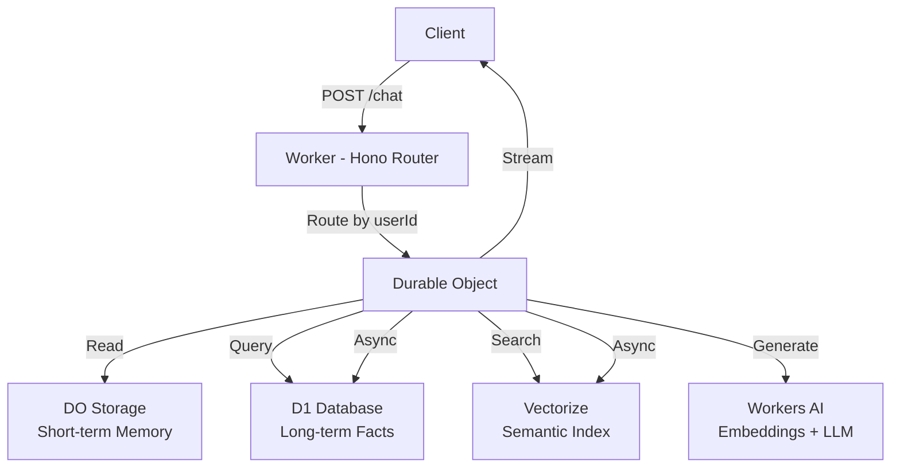

# Agent Memory Starter

> Production-ready starter for stateful AI agents with persistent memory, built entirely on Cloudflare's free tier — Workers + Durable Objects + D1 + Vectorize + Workers AI.


## Features

- **Long-term Memory**: Persistent storage for user facts, preferences, and conversation history
- **Semantic Retrieval**: Vectorize-powered similarity search for relevant memories
- **Automatic Fact Extraction**: LLM automatically extracts and stores key facts from conversations
- **Conversation Summarization**: Auto-summarizes long conversations to save context window
- **GDPR Compliant**: One-click memory deletion endpoint
- **SSE Streaming**: Real-time chat responses with server-sent events
- **100% Cloudflare Free Tier**: No infrastructure costs

## Architecture



## Quick Start

### Prerequisites

- [Cloudflare Account](https://dash.cloudflare.com/sign-up) (free tier available)
- [Wrangler CLI](https://developers.cloudflare.com/workers/wrangler/install-and-update/) v3+

### 1. Clone & Install

```bash
git clone https://github.com/liangsk53121/agent-memory-starter.git
cd agent-memory-starter
npm install
```

### 2. Create Cloudflare Resources

```bash
# Login to Cloudflare
npx wrangler login

# Create D1 database
npx wrangler d1 create agent-memory-db

# Create Vectorize index
npx wrangler vectorize create agent-memory-index --dimensions 768 --metric cosine
```

### 3. Deploy

```bash
npx wrangler deploy
```

## API Endpoints

### POST /chat

Start a chat with memory support. Returns SSE stream.

```bash
curl -X POST https://your-worker-url.workers.dev/chat \
  -H "Content-Type: application/json" \
  -d '{"userId": "user123", "message": "Hello! My name is John and I like coffee."}'
```

### GET /memory/:userId

Retrieve all memory for a user.

```bash
curl https://your-worker-url.workers.dev/memory/user123
```

### DELETE /memory/:userId

Clear all memory for a user (GDPR compliant).

```bash
curl -X DELETE https://your-worker-url.workers.dev/memory/user123
```

## Why Cloudflare Free Tier?

| Component | Cloudflare Free Tier | Self-hosted Alternative |
|-----------|---------------------|------------------------|
| Compute | 100K requests/day | $5-$50/month (VPS) |
| Database | 1GB D1 storage | $10-$100/month (Postgres) |
| Vector DB | 256K vectors | $70+/month (Pinecone) |
| LLM/Embeddings | 10K neurons/day | $10+/month (API costs) |
| **Total** | **$0** | **~$100+/month** |

## Cloudflare Free Tier Limits

| Service | Free Limit | Notes |
|---------|-----------|-------|
| Workers | 100K requests/day | Auto-scaling |
| Durable Objects | 1M requests/day | Per-object storage 128MB |
| D1 | 1GB storage | SQLite-compatible |
| Vectorize | 256K vectors | 768 dimensions |
| Workers AI | 10K neurons/day | ~300 chat completions |

## Configuration

Set environment variables in `wrangler.jsonc`:

```jsonc
{
  "vars": {
    "LLM_API_KEY": "",      // Optional: External LLM API key
    "LLM_API_BASE": "",     // Optional: External LLM base URL
    "LLM_MODEL": "@cf/meta/llama-3.1-8b-instruct"  // Default Workers AI model
  }
}
```

### Using External LLM (OpenAI/Anthropic Compatible)

```jsonc
{
  "vars": {
    "LLM_API_KEY": "sk-your-api-key",
    "LLM_API_BASE": "https://api.openai.com/v1",
    "LLM_MODEL": "gpt-4o-mini"
  }
}
```

## Demo

Open the deployed worker URL in your browser to see the demo chat interface. The demo shows:

1. Type your name and preferences
2. Refresh the page
3. Ask the agent to recall what you told it

## Project Structure

```
agent-memory-starter/
├── src/
│   ├── index.ts          # Worker entry + Hono router
│   ├── agent-do.ts       # Durable Object class
│   ├── llm.ts            # LLM abstraction layer
│   └── memory/
│       ├── extract.ts    # Fact extraction
│       ├── retrieve.ts   # Memory retrieval
│       └── summarize.ts  # Conversation summarization
├── public/
│   └── index.html        # Demo frontend
├── test/                 # Unit tests
├── schema.sql            # D1 database schema
├── wrangler.jsonc        # Cloudflare configuration
└── package.json
```

## Roadmap

- [ ] Multi-turn conversation support improvements
- [ ] Memory categories and filtering
- [ ] User authentication
- [ ] Batch memory operations
- [ ] Memory export/import
- [ ] Advanced summarization strategies

## Contributing

Contributions are welcome! Please:

1. Fork the repository
2. Create a feature branch
3. Make your changes
4. Add tests
5. Submit a pull request

## License

MIT License - see [LICENSE](LICENSE) for details.