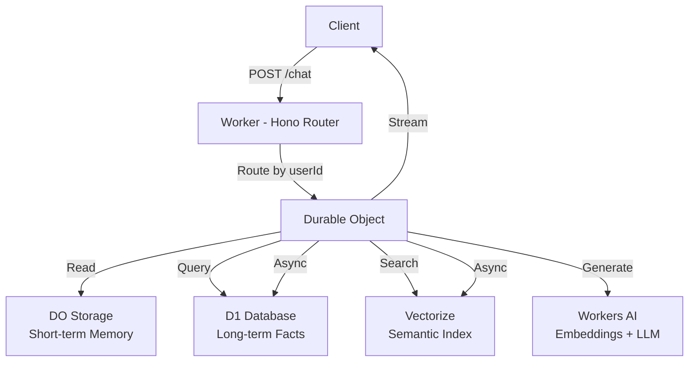

# MemoryBuddy 🧠

> **Give your AI agent a memory that lasts.** A production-ready starter that turns forgetful LLMs into stateful companions — built 100% on Cloudflare's free tier.

[](LICENSE)
[](https://workers.cloudflare.com/)
[](https://www.typescriptlang.org/)
[](#why-cloudflare-free-tier)

Most LLM-powered chats suffer from "goldfish memory" — refresh the page and everything's gone. **MemoryBuddy** fixes this with a three-tier memory architecture that lets your agent remember user facts, recall relevant context, and grow smarter over time — all without a single line of backend infrastructure code.

## ✨ Why MemoryBuddy?

| 💡 Problem | ✅ Solution |
|-----------|-------------|
| Agent forgets users between sessions | Persistent long-term memory via D1 + Vectorize |
| Relevant context gets lost in long chats | Semantic retrieval surfaces the right memory at the right time |
| Context windows fill up fast | Automatic summarization keeps conversations compact |
| Privacy regulations (GDPR) | One-click `DELETE` endpoint for complete memory wipe |
| Hosting costs add up | 100% on Cloudflare free tier — **$0/month** |

## 🎯 Core Features

- **🧠 Long-Term Memory** — Store user facts, preferences, and conversation history that survive across sessions.
- **🔍 Semantic Retrieval** — Vectorize-powered similarity search finds the right memory in milliseconds, not just keyword match.
- **🤖 Automatic Fact Extraction** — LLM automatically distills key facts from each conversation — no manual tagging required.
- **📝 Smart Summarization** — Long conversations are auto-compressed to preserve context window without losing intent.
- **🗑️ GDPR Compliant** — `DELETE /memory/:userId` wipes everything in one call.
- **⚡ SSE Streaming** — Real-time token streaming for a snappy, ChatGPT-like experience.
- **🔌 LLM-Agnostic** — Swap between Workers AI, OpenAI, or any Anthropic-compatible API with one config change.

## 🏗️ Architecture



**Three-tier memory model:**
1. **Short-term** (Durable Object storage) — Current conversation context
2. **Long-term** (D1) — Structured facts: name, preferences, key entities
3. **Semantic** (Vectorize) — Embeddings for meaning-based recall

## 🚀 Quick Start

### Prerequisites

- [Cloudflare Account](https://dash.cloudflare.com/sign-up) (free tier works)
- [Wrangler CLI](https://developers.cloudflare.com/workers/wrangler/install-and-update/) v3+
- Node.js 18+

### 1. Clone & Install

```bash
git clone https://github.com/Trainspotting31/memory-buddy.git
cd memory-buddy
npm install
```

### 2. Create Cloudflare Resources

```bash
# Authenticate with Cloudflare
npx wrangler login

# Create D1 database (structured facts)
npx wrangler d1 create memory-buddy-db

# Create Vectorize index (semantic search)
npx wrangler vectorize create memory-buddy-index --dimensions 768 --metric cosine
```

> 💡 Copy the generated `database_id` and `index_id` into your `wrangler.jsonc` after creation.

### 3. Deploy

```bash
npx wrangler deploy
```

Your agent is now live at `https://memory-buddy.<your-subdomain>.workers.dev` 🎉

## 🔌 API Reference

### `POST /chat` — Chat with memory

Returns an SSE stream of tokens. The agent reads relevant memory, generates a response, and automatically stores new facts.

```bash
curl -N -X POST https://your-worker-url.workers.dev/chat \
  -H "Content-Type: application/json" \
  -d '{"userId": "user123", "message": "Hi! I'm John and I love espresso."}'
```

### `GET /memory/:userId` — Retrieve all memory

Returns the user's complete memory profile: short-term context, long-term facts, and metadata.

```bash
curl https://your-worker-url.workers.dev/memory/user123
```

### `DELETE /memory/:userId` — Wipe memory (GDPR)

Permanently deletes all memory for the user across all storage tiers.

```bash
curl -X DELETE https://your-worker-url.workers.dev/memory/user123
```

## 💸 Why Cloudflare Free Tier?

| Component | Cloudflare Free Tier | Self-Hosted Alternative |
|-----------|---------------------|------------------------|
| Compute | 100K requests/day | $5–$50/month (VPS) |
| Database | 1GB D1 storage | $10–$100/month (Postgres) |
| Vector DB | 256K vectors | $70+/month (Pinecone) |
| LLM/Embeddings | 10K neurons/day | $10+/month (API costs) |
| **Total** | **$0** | **~$100+/month** |

## 📊 Free Tier Limits

| Service | Free Limit | Notes |
|---------|-----------|-------|
| Workers | 100K requests/day | Auto-scales globally |
| Durable Objects | 1M requests/day | 128MB per object |
| D1 | 1GB storage | SQLite-compatible |
| Vectorize | 256K vectors | 768 dimensions |
| Workers AI | 10K neurons/day | ~300 chat completions |

## ⚙️ Configuration

Set environment variables in `wrangler.jsonc`:

```jsonc
{
  "vars": {
    "LLM_API_KEY": "",      // Optional: External LLM API key
    "LLM_API_BASE": "",     // Optional: External LLM base URL
    "LLM_MODEL": "@cf/meta/llama-3.1-8b-instruct"  // Default: Workers AI
  }
}
```

### Use OpenAI, Anthropic, or any compatible API

```jsonc
{
  "vars": {
    "LLM_API_KEY": "sk-your-api-key",
    "LLM_API_BASE": "https://api.openai.com/v1",
    "LLM_MODEL": "gpt-4o-mini"
  }
}
```

## 🎮 Try the Demo

Open your deployed Worker URL in a browser. You'll see a built-in chat interface.

**Try this:**
1. Tell the agent your name and a preference ("I'm Sarah and I'm allergic to peanuts")
2. Refresh the page (or start a new session)
3. Ask: "What do you know about me?"

The agent will recall everything — that's MemoryBuddy at work.

## 📁 Project Structure

```
memory-buddy/
├── src/
│   ├── index.ts          # Worker entry + Hono router
│   ├── agent-do.ts       # Durable Object: session & memory orchestration
│   ├── llm.ts            # LLM abstraction (Workers AI / OpenAI-compatible)
│   └── memory/
│       ├── extract.ts    # LLM-powered fact extraction
│       ├── retrieve.ts   # Hybrid retrieval (D1 + Vectorize)
│       └── summarize.ts  # Conversation summarization
├── public/
│   └── index.html        # Built-in demo chat UI
├── test/                 # Unit tests (Vitest)
├── schema.sql            # D1 database schema
├── wrangler.jsonc        # Cloudflare configuration
└── package.json
```

## 🗺️ Roadmap

- [ ] Multi-turn conversation optimizations
- [ ] Memory categories & filtering
- [ ] User authentication
- [ ] Batch memory operations
- [ ] Memory export/import (JSON)
- [ ] Advanced summarization strategies
- [ ] Multi-language support

## 🤝 Contributing

Contributions are welcome! Please:

1. Fork the repository
2. Create a feature branch (`git checkout -b feature/amazing-feature`)
3. Commit your changes (`git commit -m 'Add amazing feature'`)
4. Push to the branch (`git push origin feature/amazing-feature`)
5. Open a Pull Request

## 📄 License

MIT License — see [LICENSE](LICENSE) for details.

## 💖 Acknowledgments

Built on the incredible [Cloudflare Workers](https://workers.cloudflare.com/) platform. Inspired by the need for AI agents that actually remember who you are.