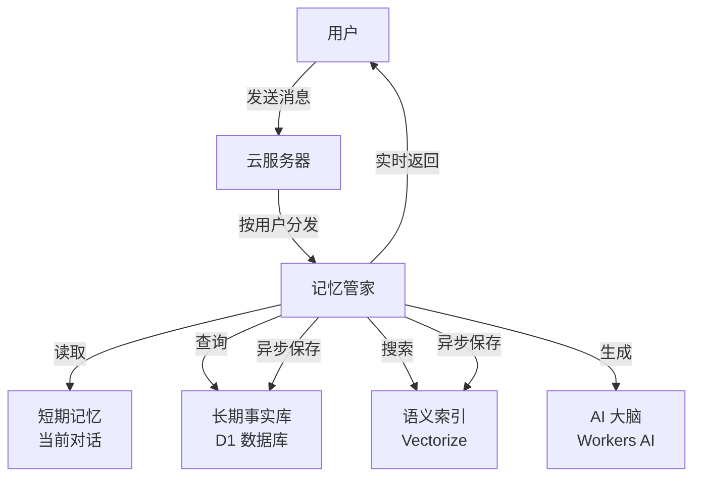

# MemoryBuddy 🧠

> **给你的 AI 装上一颗"记忆大脑"。** 完全基于 Cloudflare 免费额度构建的生产级 AI 记忆框架 - 让 AI 真正记住每个用户。

[](LICENSE)
[](https://workers.cloudflare.com/)
[](https://www.typescriptlang.org/)
[](#-为什么选择-cloudflare-免费额度)

## 🌟 这是什么？

你有没有遇到过这种情况：和 AI 聊了半天，告诉它你的名字、喜好、工作内容……结果一刷新页面，它全忘了，又变成陌生人。

这就是大多数 AI 的"金鱼记忆"问题。

**MemoryBuddy** 就是为了解决这个问题。它给 AI 加上了**三层记忆系统**：
- 📋 **短期记忆** - 记住当前对话
- 📚 **长期记忆** - 记住你的名字、喜好、重要事实
- 🔍 **语义记忆** - 理解上下文，找到最相关的回忆

就像人类一样，重要的事情它会一直记得。

## 💡 解决了什么问题？

| 😣 痛点 | ✅ MemoryBuddy 方案 |
|---------|---------------------|
| AI 聊完就忘，下次又要重新介绍自己 | 持久化长期记忆，跨会话保留用户信息 |
| 长对话中关键信息被淹没 | 语义检索，瞬间找到最相关的记忆 |
| 上下文窗口塞满，AI 开始"失忆" | 自动总结压缩，保留关键信息 |
| 担心隐私数据无法删除 | 一键 `DELETE` 接口，彻底清除所有记忆 |
| 自建服务器成本高 | 100% 基于 Cloudflare 免费额度，**0 成本** |

## ✨ 核心功能

- **🧠 长期记忆** - 用户的偏好、事实、对话历史，跨会话持久化保存
- **🔍 语义检索** - 不是简单的关键词匹配，而是理解你的意思去找相关记忆
- **🤖 自动记录** - 每次对话后，AI 自动提取值得记住的信息，无需手动操作
- **📝 智能总结** - 对话太长时自动压缩，既省空间又不丢关键信息
- **🗑️ 一键遗忘** - `DELETE /memory/:userId` 一行代码清除全部记忆，符合 GDPR
- **⚡ 实时流式回复** - 像 ChatGPT 一样的逐字输出体验
- **🔌 多模型支持** - 一行配置切换 Workers AI、OpenAI、Anthropic 等

## 🏗️ 工作原理



**三层记忆模型：**
1. **短期记忆**（Durable Object）- 当前对话上下文，秒级访问
2. **长期记忆**（D1 数据库）- 结构化事实：姓名、喜好、关键实体
3. **语义记忆**（Vectorize）- 向量嵌入，按"意思"而非"关键词"检索

## 🚀 快速开始（只要 3 步）

### 准备工作

- [Cloudflare 账号](https://dash.cloudflare.com/sign-up)（免费即可）
- [Wrangler CLI](https://developers.cloudflare.com/workers/wrangler/install-and-update/) v3+
- Node.js 18+

### 第一步：克隆项目

```bash
git clone https://github.com/Trainspotting31/memory-buddy.git
cd memory-buddy
npm install
```

### 第二步：创建云端资源

```bash
# 登录 Cloudflare
npx wrangler login

# 创建 D1 数据库（存储结构化记忆）
npx wrangler d1 create memory-buddy-db

# 创建 Vectorize 向量索引（语义搜索）
npx wrangler vectorize create memory-buddy-index --dimensions 768 --metric cosine
```

> 💡 创建完成后，把生成的 `database_id` 和 `index_id` 填入 `wrangler.jsonc`。

### 第三步：部署上线

```bash
npx wrangler deploy
```

部署成功后，访问 `https://memory-buddy.<你的子域名>.workers.dev` 即可开始体验 🎉

## 🔌 API 接口

### `POST /chat` - 带记忆的对话

返回 SSE 流式响应。AI 会先检索相关记忆，再生成回复，最后自动保存新信息。

```bash
curl -N -X POST https://你的-worker地址.workers.dev/chat \
  -H "Content-Type: application/json" \
  -d '{"userId": "user123", "message": "你好！我叫小明，我喜欢喝咖啡。"}'
```

### `GET /memory/:userId` - 查看全部记忆

返回用户的完整记忆档案：短期上下文、长期事实、元数据。

```bash
curl https://你的-worker地址.workers.dev/memory/user123
```

### `DELETE /memory/:userId` - 清除全部记忆（GDPR 合规）

永久删除该用户在所有存储层的全部记忆数据。

```bash
curl -X DELETE https://你的-worker地址.workers.dev/memory/user123
```

## 💸 为什么选择 Cloudflare 免费额度？

| 服务 | Cloudflare 免费额度 | 自建方案 |
|------|---------------------|---------|
| 计算能力 | 每天 10 万次请求 | $5-$50/月 |
| 数据库 | 1GB 存储空间 | $10-$100/月 |
| 向量搜索 | 25.6 万个向量 | $70+/月 |
| AI 服务 | 每天 1 万次调用 | $10+/月 |
| **总计** | **$0** | **~$100+/月** |

## 📊 免费额度限制一览

| 服务 | 免费限额 | 说明 |
|------|---------|------|
| Workers | 10 万次/天 | 全球自动扩容 |
| Durable Objects | 100 万次/天 | 每个实例 128MB |
| D1 数据库 | 1GB | SQLite 兼容 |
| Vectorize | 25.6 万向量 | 768 维 |
| Workers AI | 1 万次/天 | 约 300 次聊天 |

## ⚙️ 配置

在 `wrangler.jsonc` 中设置环境变量：

```jsonc
{
  "vars": {
    "LLM_API_KEY": "",      // 可选：外部 LLM API Key
    "LLM_API_BASE": "",     // 可选：外部 LLM 地址
    "LLM_MODEL": "@cf/meta/llama-3.1-8b-instruct"  // 默认：Workers AI
  }
}
```

### 切换到 OpenAI / Anthropic / 其他兼容 API

```jsonc
{
  "vars": {
    "LLM_API_KEY": "sk-你的密钥",
    "LLM_API_BASE": "https://api.openai.com/v1",
    "LLM_MODEL": "gpt-4o-mini"
  }
}
```

## 🎮 体验 Demo

部署后打开 Worker URL，你会看到一个内置的聊天界面。

**试试这样玩：**
1. 告诉 AI 你的名字和一个偏好（"我叫小美，我对花生过敏"）
2. 刷新页面（或开启新会话）
3. 问它："你知道我是谁吗？"

它会准确记住你说的每一件事 - 这就是 MemoryBuddy 的魔力。

## 📁 项目结构

```
memory-buddy/
├── src/
│   ├── index.ts          # 入口文件 + Hono 路由
│   ├── agent-do.ts       # 记忆管家（会话与记忆调度）
│   ├── llm.ts            # AI 大脑（支持 Workers AI / OpenAI 兼容）
│   └── memory/
│       ├── extract.ts    # 记忆提取器（LLM 自动抽取事实）
│       ├── retrieve.ts   # 记忆检索器（D1 + Vectorize 混合检索）
│       └── summarize.ts  # 记忆压缩器（对话自动总结）
├── public/
│   └── index.html        # 内置 Demo 聊天界面
├── test/                 # 单元测试（Vitest）
├── schema.sql            # D1 数据库表结构
├── wrangler.jsonc        # Cloudflare 配置
└── package.json
```

## 🗺️ 发展路线

- [ ] 多轮对话深度优化
- [ ] 记忆分类与过滤
- [ ] 用户认证
- [ ] 批量记忆操作
- [ ] 记忆导出/导入（JSON）
- [ ] 高级总结策略
- [ ] 多语言支持

## 🤝 贡献指南

欢迎贡献代码！流程：

1. Fork 本仓库
2. 创建功能分支（`git checkout -b feature/amazing-feature`）
3. 提交更改（`git commit -m 'Add amazing feature'`）
4. 推送分支（`git push origin feature/amazing-feature`）
5. 发起 Pull Request

## ❓ 常见问题

**Q: 真的完全免费吗？**  
A: 是的。Cloudflare 免费额度足够个人项目和小型应用使用。除非你的日请求量超过 10 万次，否则不会产生任何费用。

**Q: 数据存储在哪里？**  
A: 全部在 Cloudflare 的全球边缘网络中。D1 数据库存结构化数据，Vectorize 存向量嵌入，Durable Object 存会话上下文。

**Q: 能用自己的 LLM 吗？**  
A: 当然可以。任何兼容 OpenAI API 格式的服务都能接入，只需修改 `wrangler.jsonc` 中的三个环境变量。

**Q: 适合生产环境吗？**  
A: 适合。Cloudflare 的全球边缘网络提供 99.9%+ 的可用性，自动扩容，无需运维。

## 📄 许可证

MIT 许可证 - 详见 [LICENSE](LICENSE)

## 💖 致谢

基于强大的 [Cloudflare Workers](https://workers.cloudflare.com/) 平台构建。灵感来源于一个简单的愿望：让 AI 真正记住你是谁。