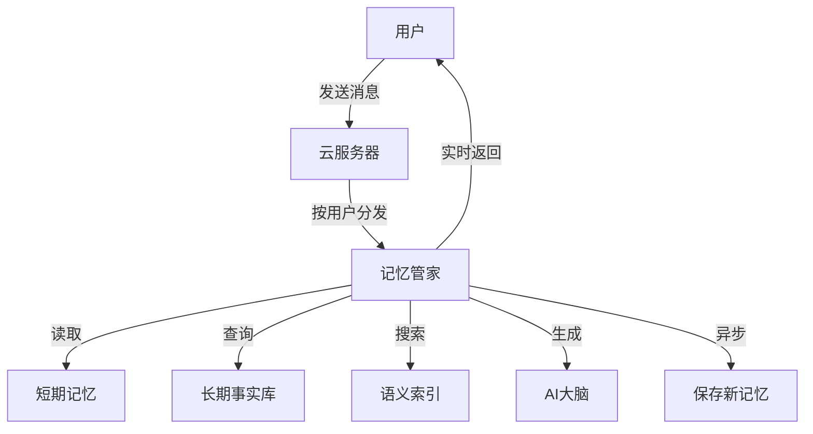

# MemoryBuddy 🧠

> 给 AI 助手装上"记忆大脑"！完全基于 Cloudflare 免费服务构建的生产级 AI Agent 记忆框架。

## 🌟 什么是 MemoryBuddy？

想象一下，你有一个 AI 助手，它能记住你昨天说过的话、你的喜好、你提到过的重要事情。今天你再次打开对话，它依然认识你，还记得你喜欢喝咖啡、你的生日是哪天...

**MemoryBuddy** 就是帮你实现这个梦想的工具！它让 AI 助手拥有**长期记忆**，就像人类一样能够记住重要信息。

## ✨ 核心功能

- **🧠 长期记忆**：持久化存储用户的事实、偏好和对话历史
- **🔍 智能检索**：用 AI 理解你的问题，自动找出相关的记忆
- **🤖 自动记录**：每次对话后自动提取值得记住的信息
- **📝 自动总结**：对话太长时自动压缩，节省空间
- **🗑️ 一键遗忘**：随时清除记忆，保护隐私
- **⚡ 实时对话**：像聊天一样流畅的实时回复
- **💰 完全免费**：基于 Cloudflare 免费额度运行

## 🏗️ 工作原理



简单来说：
1. 用户发送消息
2. 系统先查看短期记忆（最近对话）和长期记忆（已保存的事实）
3. AI 结合记忆内容生成回复
4. 自动提取新信息保存到记忆库

## 🚀 快速开始

只需 3 步，你的 AI 助手就能拥有记忆！

### 准备工作

- [Cloudflare 账号](https://dash.cloudflare.com/sign-up)（免费即可）
- [Wrangler CLI](https://developers.cloudflare.com/workers/wrangler/install-and-update/) v3+

### 第一步：克隆项目

```bash
git clone https://github.com/Trainspotting31/memory-buddy.git
cd memory-buddy
npm install
```

### 第二步：创建云端资源

```bash
# 登录 Cloudflare
npx wrangler login

# 创建数据库（存储记忆）
npx wrangler d1 create memory-buddy-db

# 创建向量索引（智能搜索）
npx wrangler vectorize create memory-buddy-index --dimensions 768 --metric cosine
```

### 第三步：部署上线

```bash
npx wrangler deploy
```

部署完成后，打开浏览器访问你的 Worker URL，就能体验带记忆的 AI 对话了！

## 🔌 API 接口

### 发送消息（带记忆）

```bash
curl -X POST https://你的-worker地址.workers.dev/chat \
  -H "Content-Type: application/json" \
  -d '{"userId": "user123", "message": "你好！我叫小明，我喜欢喝咖啡。"}'
```

### 查看记忆

```bash
curl https://你的-worker地址.workers.dev/memory/user123
```

### 清除记忆

```bash
curl -X DELETE https://你的-worker地址.workers.dev/memory/user123
```

## 💸 为什么选择 Cloudflare 免费额度？

| 服务 | Cloudflare 免费额度 | 自建方案 |
|------|---------------------|---------|
| 计算能力 | 每天 10 万次请求 | $5-$50/月 |
| 数据库 | 1GB 存储空间 | $10-$100/月 |
| 向量搜索 | 25.6 万个向量 | $70+/月 |
| AI 服务 | 每天 1 万次调用 | $10+/月 |
| **总计** | **$0** | **~$100+/月** |

## 📊 免费额度限制

| 服务 | 免费限额 | 说明 |
|------|---------|------|
| Workers | 10 万次/天 | 自动扩容 |
| Durable Objects | 100 万次/天 | 每个实例 128MB |
| D1 数据库 | 1GB | SQLite 兼容 |
| Vectorize | 25.6 万向量 | 768 维 |
| Workers AI | 1 万次/天 | 约 300 次聊天 |

## ⚙️ 配置

在 `wrangler.jsonc` 中设置环境变量：

```jsonc
{
  "vars": {
    "LLM_API_KEY": "",      // 可选：外部 LLM API Key
    "LLM_API_BASE": "",     // 可选：外部 LLM 地址
    "LLM_MODEL": "@cf/meta/llama-3.1-8b-instruct"  // 默认模型
  }
}
```

### 使用外部 LLM（如 OpenAI）

```jsonc
{
  "vars": {
    "LLM_API_KEY": "sk-你的密钥",
    "LLM_API_BASE": "https://api.openai.com/v1",
    "LLM_MODEL": "gpt-4o-mini"
  }
}
```

## 🎮 演示

部署后打开 Worker URL，你会看到一个聊天界面。试试：

1. 告诉 AI 你的名字和喜好
2. 刷新页面
3. 问它："你还记得我叫什么吗？"

它应该能准确回答你！

## 📁 项目结构

```
memory-buddy/
├── src/
│   ├── index.ts          # 入口文件
│   ├── agent-do.ts       # 记忆管家（会话管理）
│   ├── llm.ts            # AI 大脑（模型调用）
│   └── memory/
│       ├── extract.ts    # 记忆提取器
│       ├── retrieve.ts   # 记忆检索器
│       └── summarize.ts  # 记忆压缩器
├── public/
│   └── index.html        # 演示页面
├── test/                 # 测试
├── schema.sql            # 数据库表结构
└── wrangler.jsonc        # Cloudflare 配置
```

## 🗺️ 发展路线

- [ ] 多轮对话优化
- [ ] 记忆分类管理
- [ ] 用户认证
- [ ] 批量记忆操作
- [ ] 记忆导出/导入
- [ ] 高级总结策略

## 🤝 贡献

欢迎贡献！请：

1. Fork 项目
2. 创建功能分支
3. 提交代码
4. 添加测试
5. 发起 Pull Request

## 📄 许可证

MIT 许可证 - 详见 [LICENSE](LICENSE)